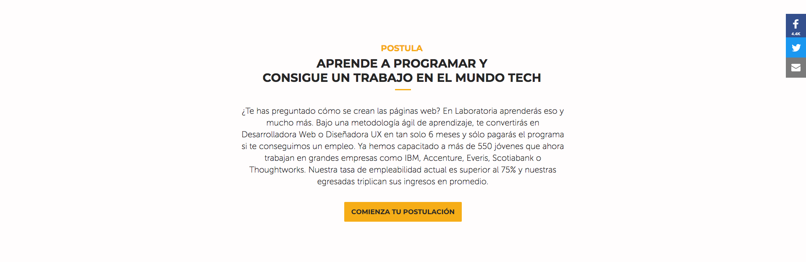
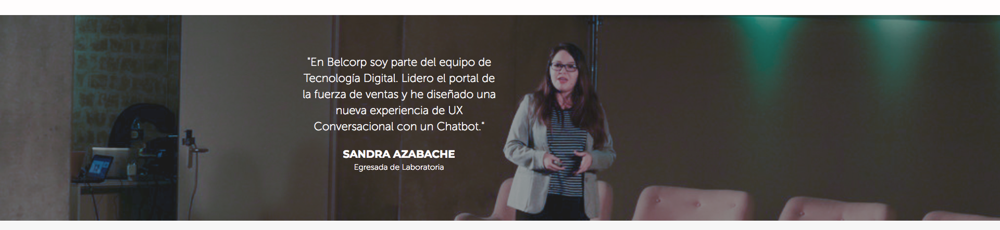
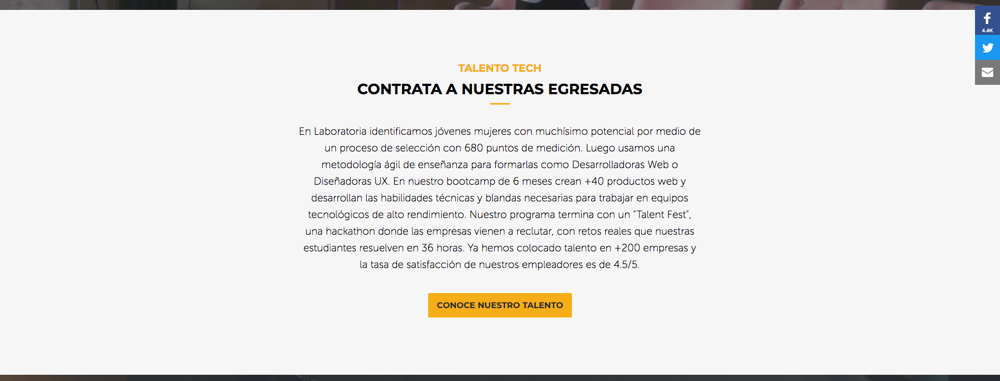
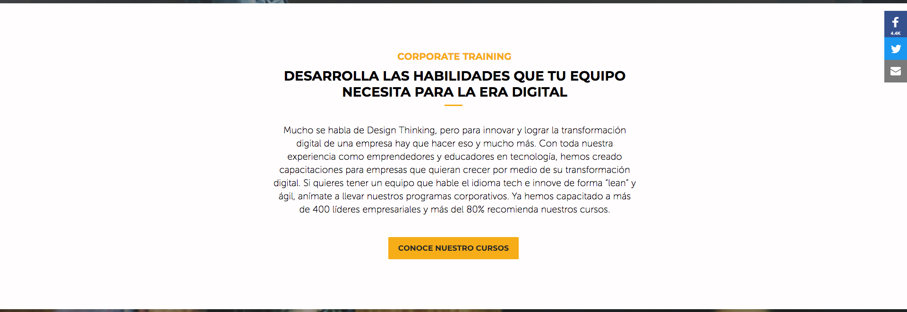
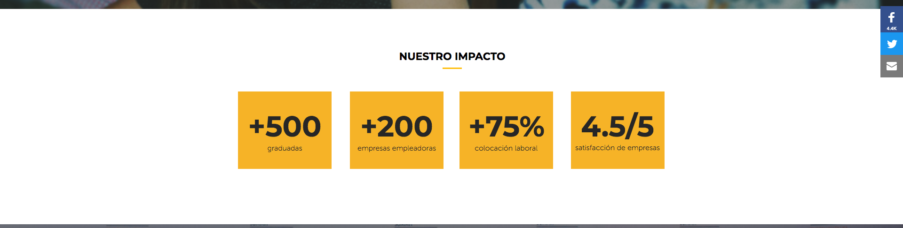
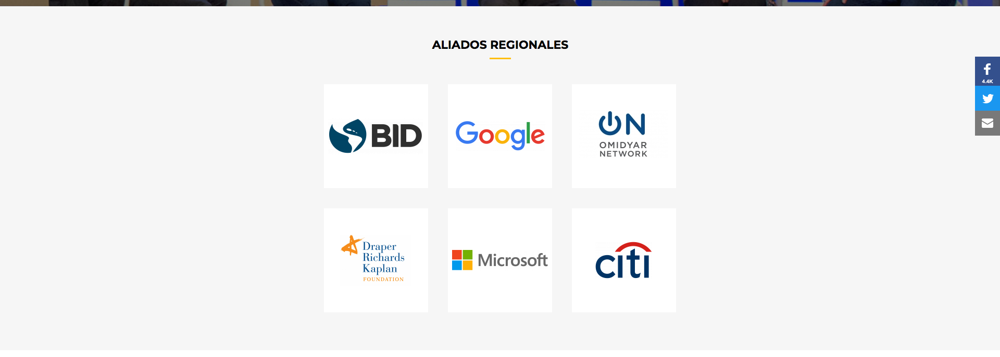
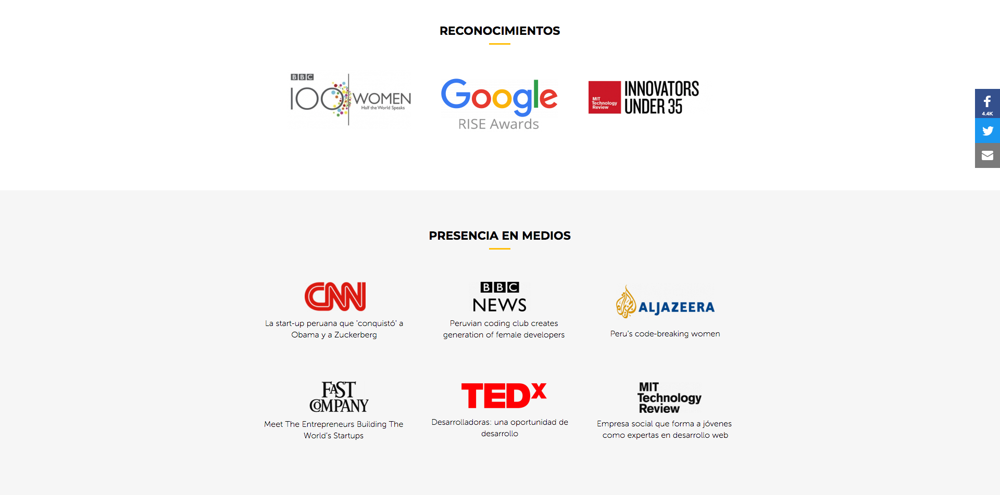
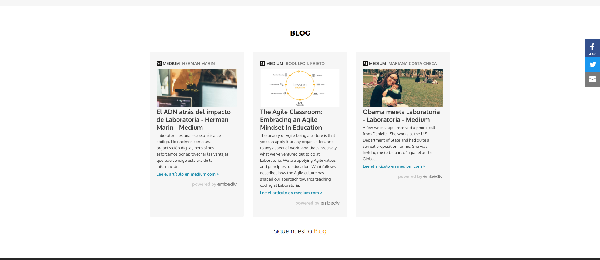

# Elige una web de tu preferencia y explica qué partes conforman el UX y qué partes el UI.

##Web de Laboratoria

### 1ª parte
#### Elementos UI
- Menú global con eventos click que dirigen a un link.
- Color y area de texto de botones de menú global.
- Hover de botón Estudiantes.
- Botones con iconos de redes sociales.
- Posición de la imagen, área y color de texto.

####Elementos UX
- Fotografía al principio de la página que refleja felicidad.
- Texto sobre la fotografía que suma la idea de transformación a la de felicidad.

### 2ª parte
#### Elementos UI
- Area de texto.
- Botón “Comienza tu postulación”.
- Color de botón y área de texto.

#### Elementos UX
- Contenido de texto dirigido a posibles postulantes

### 3ª parte
#### Elementos UI
- Posición de la imagen, área y color de texto.

#### Elementos UX
- Fotografía y texto con un testimonio de una egresada que busca reflejar la veracidad, hacia las posibles postulantes.

### 4ª parte
#### Elementos UI
- Area de texto.
- Botón “Conoce nuestro talento”.
- Color de botón y de área de texto.

#### Elementos UX
Contenido de texto dirigido a posibles empleadores.

### 5ª parte
#### Elementos UI
- Posición de la imagen, área y color de texto.

#### Elementos UX
- Fotografía y texto con un testimonio de un CEO que busca reflejar la veracidad, hacia los posibles empleadores.

### 6ª parte
#### Elementos UI
- Area de texto.
- Botón “Conoce nuestros cursos”.
- Color de botón y de área de texto.

#### Elementos UX
- Contenido de texto dirigido a posibles empleadores y a empresas.

### 7ª parte
#### Elementos UI
- Posición de la imagen, área y color de texto.

#### Elementos UX
- Fotografía y texto con un testimonio sobre la transformación del método de trabajo para empresas.

### 8ª parte
#### Elementos UI
- Color de tipografía y background de datos.

#### Elementos UX
- Información, busca generar confianza a travez de la veracidad de los resultados.

### 9ª parte
#### Elementos UI
- Posición de la imagen, área y color de texto.

#### Elementos UX
- Frase de Barack Obama que ratifica la veracidad de los resultados, contextualiza con fotografía con innovadores y líderes internacionales.

### 10ª parte
#### Elementos UI
- Color de tipografía.
- Posiciones de imágenes de logos.

#### Elementos UX
- Imágenes de iconos de los aliados, reconocimientos y presencia en medios para generar confianza.

### 11ª parte
#### Elementos UI
- Color de tipografia
- Posiciones de imágenes

#### Elementos UX
- Imágenes de iconos de los aliados, reconocimientos y presencia en medios para generar confianza.

### 12ª parte
#### Elementos UI
- Color de tipografia.
- Enlaces a blog y posición.
- Iconos-botones a redes sociales.
- Navegación inline “Sigue nuestro Blog” con evento click.

#### Elementos UX
-Enlaces de blog especialmente la fotografía de Mariana Costa en la que se muestra en un contexto familiar, que genera empatía.

### 13ª parte
#### Elementos UI
- Color de background.
- Area de texto.
- Evento click en menu local.

#### Elementos UX
-Color de background que genera un contexto sobrio.

