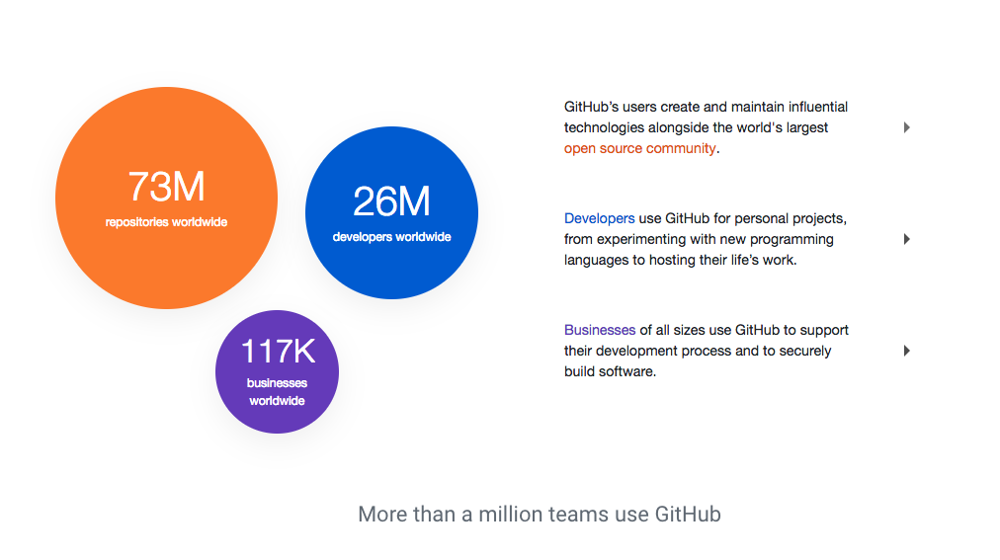
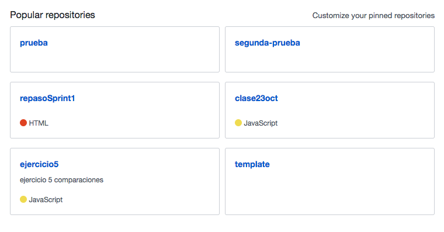
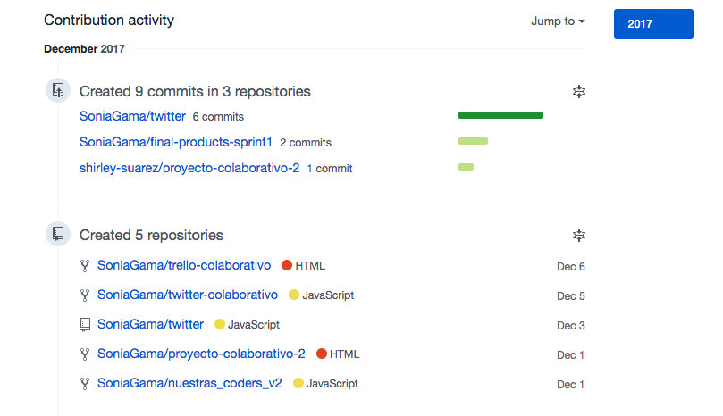

# Identifica los elementos de navegación en los siguientes sites.
## Sitio web de GitHub

### Navegación global

### Navegación inline a elementos locales

### Navegación local

### Navegación local

### Navegación suplementaria y local

### Navegación local

### Navegación local

### Navegación local e inline

### Navegación local

### Navegación facetada

### Navegación contextual

### Navegación contextual

### Navegación inline

### Navegación local

